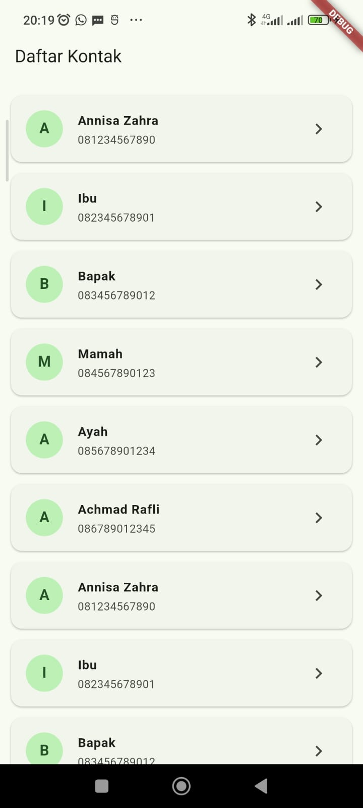
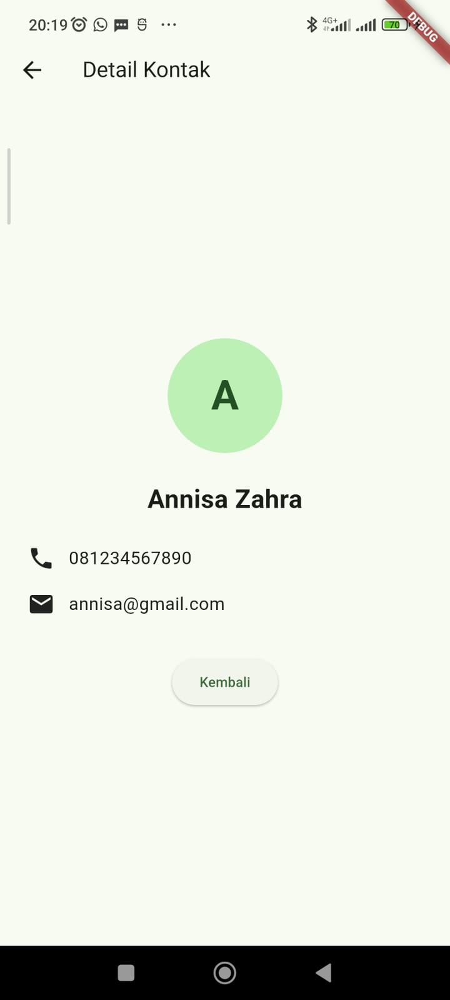

# Aplikasi Daftar Kontak

## Tugas Pertemuan 2 — Pemrograman Mobile

Aplikasi ini dibuat untuk memenuhi tugas Pertemuan 2 pada materi **Layout, ListView, dan Navigasi Antar Halaman**.

## Fitur

1. Menampilkan daftar kontak.
2. Setiap kontak memiliki nama, nomor telepon, dan email.
3. Avatar menggunakan huruf pertama nama.
4. Daftar menggunakan `ListView.builder`.
5. Setiap item menggunakan `ListTile`.
6. Menekan kontak membuka halaman detail.
7. Halaman detail menampilkan seluruh informasi kontak.
8. Tombol kembali digunakan untuk kembali ke halaman utama.

## Identitas

**Nama:** Ilham Firmansyah  
**NIM:** 20240801102  
**Jurusan:** Teknik Informatika

## Cara Menjalankan

Jalankan:

```bash
flutter run
```

## Screenshot

Screenshot aplikasi akan ditambahkan pada folder:

```text
images/
```

### Daftar Kontak


### Detail Kontak

