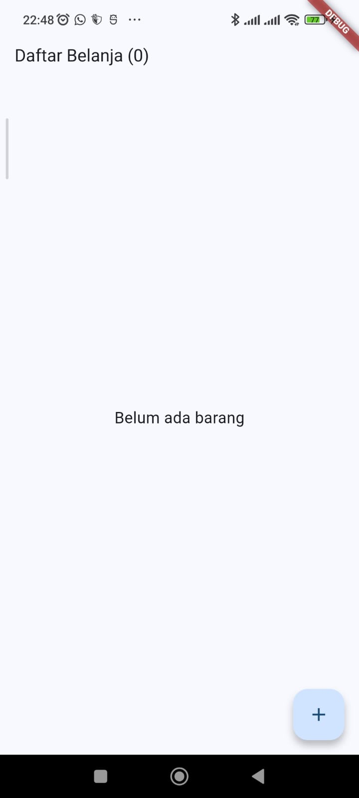
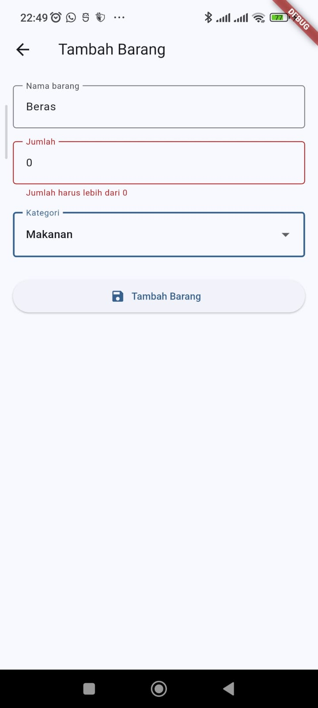
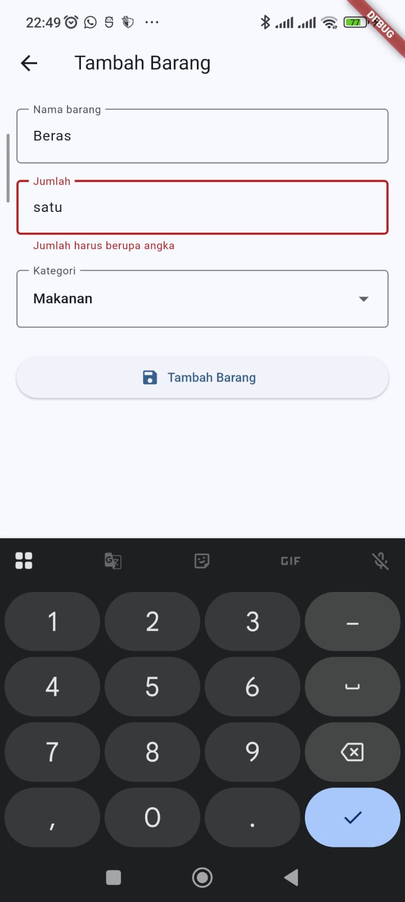
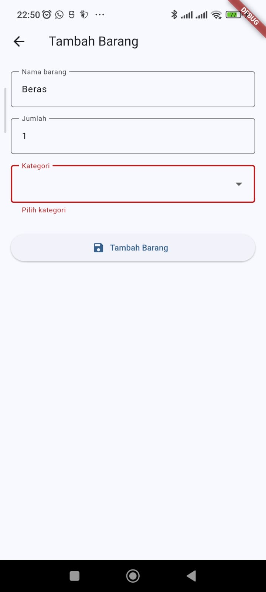
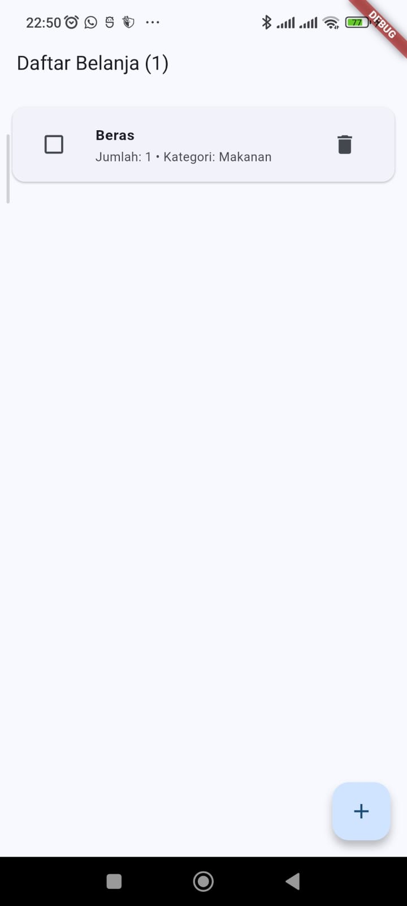
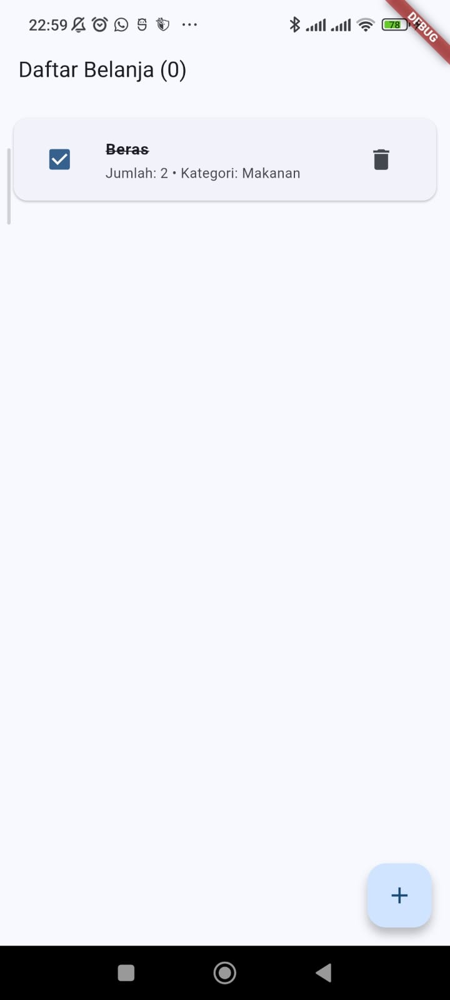

# Aplikasi Daftar Belanja

## Tugas Pertemuan 3 — Pemrograman Mobile

Aplikasi **Daftar Belanja** merupakan tugas utama pada Praktikum Pemrograman Mobile Pertemuan 3 dengan topik **Form Input dan State Management**.

Aplikasi ini dibuat menggunakan Flutter dan menerapkan form dengan validasi, dropdown, state management menggunakan `ChangeNotifier`, serta Provider untuk berbagi state antara halaman form dan halaman daftar.

---

# 1. Identitas

| Keterangan | Data |
|---|---|
| Nama | Ilham Firmansyah |
| NIM | 20240801102 |
| Jurusan | Teknik Informatika |
| Mata Kuliah | Pemrograman Mobile |
| Pertemuan | 3 |
| Topik | Form Input dan State Management |

---

# 2. Deskripsi Aplikasi

Aplikasi Daftar Belanja terdiri dari dua halaman utama:

1. **Halaman Daftar Belanja**
2. **Halaman Form Tambah Barang**

Halaman daftar digunakan untuk melihat seluruh barang yang telah ditambahkan, menandai barang sebagai sudah dibeli, dan menghapus barang.

Halaman form digunakan untuk memasukkan barang baru dengan validasi pada setiap input.

State aplikasi dikelola menggunakan satu `ChangeNotifier` dan dibagikan kepada widget menggunakan Provider.

---

# 3. Tujuan Pembuatan

Aplikasi ini dibuat untuk menerapkan materi yang dipelajari pada Pertemuan 3, yaitu:

- `TextField` dan `TextEditingController`
- `Form`
- `TextFormField`
- Validasi input
- `DropdownButtonFormField`
- `Checkbox`
- `ChangeNotifier`
- `ChangeNotifierProvider`
- `context.watch`
- `context.read`
- `notifyListeners`
- `ListView.builder`
- `Navigator.push`
- `Navigator.pop`

---

# 4. Ketentuan Tugas

Berdasarkan modul Pertemuan 3, aplikasi Daftar Belanja harus memiliki ketentuan berikut:

## Halaman Form Tambah

Form harus memiliki:

- Nama barang.
- Jumlah barang.
- Kategori barang.

Setiap input harus memiliki validasi.

### Validasi Nama

Nama barang wajib diisi.

### Validasi Jumlah

Jumlah barang:

- wajib diisi;
- harus berupa angka;
- harus lebih dari 0.

### Validasi Kategori

Kategori barang wajib dipilih melalui dropdown.

---

## Halaman Daftar

Halaman daftar harus:

- Menampilkan seluruh barang.
- Menampilkan jumlah barang.
- Memungkinkan barang dicentang sebagai sudah dibeli.
- Memungkinkan barang dihapus.
- Menampilkan jumlah barang yang belum dibeli pada AppBar.

---

## State Management

State aplikasi disimpan pada satu `ChangeNotifier`.

State kemudian dibagikan menggunakan:

```dart
ChangeNotifierProvider
```

Widget membaca state menggunakan:

```dart
context.watch<BelanjaModel>()
```

dan menjalankan aksi terhadap model menggunakan:

```dart
context.read<BelanjaModel>()
```

---

# 5. Struktur Data

Setiap barang disimpan dalam objek `BarangBelanja`.

Struktur data:

```dart
class BarangBelanja {
  final String nama;
  final int jumlah;
  final String kategori;
  bool sudahDibeli;
}
```

Properti yang digunakan:

| Properti | Tipe | Keterangan |
|---|---|---|
| `nama` | `String` | Nama barang |
| `jumlah` | `int` | Jumlah barang |
| `kategori` | `String` | Kategori barang |
| `sudahDibeli` | `bool` | Status pembelian |

---

# 6. State Management

State aplikasi dikelola melalui class:

```dart
class BelanjaModel extends ChangeNotifier
```

Model memiliki beberapa operasi utama.

## Menambahkan barang

```dart
void tambah({
  required String nama,
  required int jumlah,
  required String kategori,
})
```

Method ini menambahkan objek barang ke dalam daftar.

---

## Mengubah status barang

```dart
void toggle(int index)
```

Method ini mengubah status:

```text
Belum dibeli
      ↕
Sudah dibeli
```

Setelah perubahan dilakukan, model memanggil:

```dart
notifyListeners();
```

agar widget yang menggunakan state dapat diperbarui.

---

## Menghapus barang

```dart
void hapus(int index)
```

Method ini menghapus barang berdasarkan index.

---

## Menghitung barang belum dibeli

Aplikasi memiliki getter:

```dart
int get jumlahBelumDibeli
```

Getter tersebut menghitung jumlah barang yang masih belum ditandai sebagai sudah dibeli.

Nilainya ditampilkan pada AppBar.

---

# 7. Halaman Daftar Belanja

Halaman daftar menggunakan:

```dart
ListView.builder
```

untuk menampilkan seluruh barang.

Setiap barang menggunakan:

```dart
Card
```

dan:

```dart
ListTile
```

Komponen setiap item terdiri dari:

- Checkbox
- Nama barang
- Jumlah
- Kategori
- Tombol hapus

---

# 8. Checkbox Sudah Dibeli

Checkbox digunakan untuk mengubah status barang.

Ketika checkbox belum dicentang:

```text
Belum dibeli
```

Ketika checkbox dicentang:

```text
Sudah dibeli
```

Nama barang juga diberikan efek coret ketika sudah dibeli.

Aksi dilakukan menggunakan:

```dart
context.read<BelanjaModel>().toggle(index);
```

---

# 9. Menghapus Barang

Setiap item memiliki tombol hapus.

Ketika tombol ditekan:

```dart
context.read<BelanjaModel>().hapus(index);
```

barang langsung dihapus dari daftar.

---

# 10. Halaman Form Tambah Barang

Halaman form menggunakan:

```dart
Form(
  key: _formKey,
)
```

Setiap field menggunakan validator.

Input yang tersedia:

```text
Nama Barang
Jumlah
Kategori
```

---

# 11. Validasi Nama Barang

Nama barang tidak boleh kosong.

Validasi:

```dart
if (nama.isEmpty) {
  return 'Nama barang wajib diisi';
}
```

Jika pengguna tidak mengisi nama, aplikasi menampilkan pesan error.

---

# 12. Validasi Jumlah

Jumlah harus memenuhi tiga kondisi:

1. Tidak boleh kosong.
2. Harus berupa angka.
3. Harus lebih dari 0.

Validasi angka menggunakan:

```dart
final angka = int.tryParse(jumlah);
```

Jika bukan angka:

```text
Jumlah harus berupa angka
```

Jika nilainya 0 atau kurang:

```text
Jumlah harus lebih dari 0
```

---

# 13. Validasi Kategori

Kategori menggunakan:

```dart
DropdownButtonFormField
```

Kategori harus dipilih sebelum data dapat disimpan.

Jika belum memilih kategori:

```text
Pilih kategori
```

---

# 14. Alur Aplikasi

Alur utama aplikasi:

```text
Halaman Daftar Belanja
          │
          │ tekan tombol +
          ▼
   Halaman Form Tambah
          │
          │ isi data
          ▼
        Validasi
          │
     ┌────┴────┐
     │         │
   gagal      valid
     │         │
     ▼         ▼
   error      simpan
               │
               ▼
      Halaman Daftar
```

---

# 15. Navigasi

Dari halaman daftar ke halaman form digunakan:

```dart
Navigator.push(
  context,
  MaterialPageRoute(
    builder: (_) => const FormBelanjaPage(),
  ),
);
```

Setelah data berhasil disimpan, halaman form ditutup menggunakan:

```dart
Navigator.pop(context);
```

---

# 16. Empty State

Jika belum ada barang yang ditambahkan, halaman daftar menampilkan:

```text
Belum ada barang
```

di tengah layar.

Hal ini membantu pengguna mengetahui bahwa daftar masih kosong.

---

# 17. Struktur Project

```text
daftar_belanja/
├── README.md
├── images/
│   ├── 1_daftarkosong.png
│   ├── 2_semuаkosong.png
│   ├── 3_jumlah0.png
│   ├── 4_jumlahpakehuruf.png
│   ├── 5_kategorikosong.png
│   └── 6_daftarbelanja.png
├── lib/
│   └── main.dart
├── android/
├── ios/
├── web/
├── test/
├── windows/
├── macos/
├── linux/
├── pubspec.yaml
└── ...
```

---

# 18. Screenshot Hasil Pengujian

## 18.1 Daftar Belanja Kosong

Screenshot menunjukkan kondisi ketika belum terdapat barang pada daftar.



---

## 18.2 Form dengan Input Kosong

Screenshot menunjukkan kondisi ketika form belum diisi dan validasi dilakukan.


---

## 18.3 Validasi Jumlah Nol

Screenshot menunjukkan validasi ketika jumlah barang diisi dengan angka `0`.

Pesan yang diharapkan:

```text
Jumlah harus lebih dari 0
```



---

## 18.4 Validasi Jumlah Bukan Angka

Screenshot menunjukkan validasi ketika jumlah diisi menggunakan karakter selain angka.

Pesan yang diharapkan:

```text
Jumlah harus berupa angka
```



---

## 18.5 Validasi Kategori

Screenshot menunjukkan kondisi ketika kategori belum dipilih.

Pesan yang diharapkan:

```text
Pilih kategori
```



---

## 18.6 Daftar Belanja Setelah Data Ditambahkan

Screenshot menunjukkan halaman daftar setelah barang berhasil ditambahkan.

Halaman menampilkan:

- Nama barang.
- Jumlah.
- Kategori.
- Checkbox.
- Tombol hapus.
- Jumlah barang belum dibeli pada AppBar.



---

## 18.7 Daftar Belanja yang diceklis

Screenshot menunjukkan status barang ketika diceklis, stoknya berkurang

Halaman menampilkan:

- Nama barang tercoret ketika stok habis.
- Jumlah.
- Kategori.
- Checkbox.
- Tombol hapus.
- Jumlah barang berkurang pada AppBar.



---

# 19. Cara Menjalankan Project

Pastikan berada pada folder project:

```bash
cd daftar_belanja
```

Install dependency:

```bash
flutter pub get
```

Jalankan aplikasi:

```bash
flutter run
```

Untuk memeriksa kondisi Flutter:

```bash
flutter doctor
```

---

# 20. Dependency

Project menggunakan package:

```text
provider
```

Provider digunakan untuk mengimplementasikan state management menggunakan `ChangeNotifier`.

Package dapat ditambahkan dengan:

```bash
flutter pub add provider
```

---

# 21. Hasil Implementasi

Aplikasi telah menerapkan:

- Form input.
- Validasi nama.
- Validasi jumlah.
- Validasi jumlah harus lebih dari 0.
- Validasi jumlah harus berupa angka.
- Dropdown kategori.
- Validasi kategori.
- `ChangeNotifier`.
- Provider.
- `context.watch`.
- `context.read`.
- `notifyListeners`.
- `ListView.builder`.
- Checkbox status pembelian.
- Penghapusan barang.
- Navigasi antar halaman.
- Empty state.
- Jumlah barang belum dibeli pada AppBar.

---

# 22. Pengumpulan

Sesuai ketentuan modul, pengumpulan tugas terdiri dari:

1. Screenshot halaman Form Tambah.
2. Screenshot halaman Daftar Belanja.
3. Screenshot tampilan pesan error validasi.
4. Berkas `main.dart` atau tautan repository GitHub.

Screenshot pengujian disimpan pada:

```text
images/
```

Sedangkan source code utama terdapat pada:

```text
lib/main.dart
```

---

# 23. Checklist Tugas

## Form Tambah

- [x] Nama barang wajib diisi.
- [x] Jumlah wajib diisi.
- [x] Jumlah harus berupa angka.
- [x] Jumlah harus lebih dari 0.
- [x] Kategori menggunakan dropdown.
- [x] Kategori wajib dipilih.
- [x] Validasi setiap input.

## Halaman Daftar

- [x] Menampilkan semua barang.
- [x] Barang dapat dicentang sebagai sudah dibeli.
- [x] Barang dapat dihapus.
- [x] AppBar menampilkan jumlah barang belum dibeli.
- [x] Menampilkan pesan ketika daftar kosong.

## State Management

- [x] Menggunakan `ChangeNotifier`.
- [x] Menggunakan `ChangeNotifierProvider`.
- [x] Menggunakan `context.watch`.
- [x] Menggunakan `context.read`.
- [x] Menggunakan `notifyListeners`.

## Dokumentasi

- [x] README tugas dibuat.
- [x] Source code `main.dart` tersedia.
- [x] Screenshot daftar kosong.
- [x] Screenshot form kosong.
- [x] Screenshot validasi jumlah 0.
- [x] Screenshot validasi jumlah bukan angka.
- [x] Screenshot validasi kategori.
- [x] Screenshot daftar belanja.
- [x] Screenshot ceklis barang.

---

# 24. Kesimpulan

Aplikasi Daftar Belanja berhasil dibuat dengan menerapkan konsep form input, validasi, state management, dan Provider.

Pengguna dapat menambahkan barang melalui form, memilih jumlah dan kategori, kemudian melihat seluruh barang pada halaman daftar. Barang dapat ditandai sebagai sudah dibeli maupun dihapus.

State aplikasi dikelola secara terpusat menggunakan `ChangeNotifier` dan dibagikan dengan Provider sehingga perubahan data dapat langsung tercermin pada halaman yang menggunakan data tersebut.